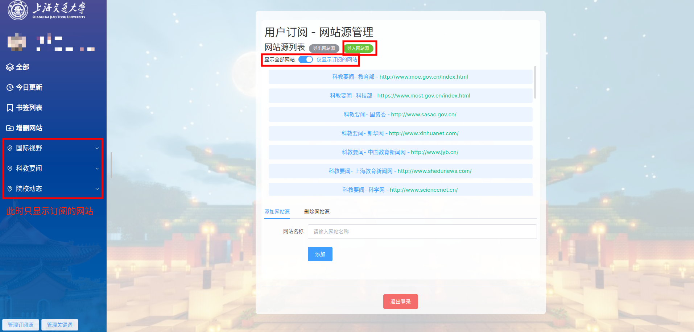

# Web 前端

Web 前端采用 vue 开发，使用了 vue router，element-ui 和 naive-ui。

## 网站功能介绍

### 顶栏

顶栏中包含了对于显示的文章的一些筛选和显示功能：

- 类别复选框：仅在“全部”页面中显示，可以点击选择显示的类别。
- 时间选择：可以选择显示的时间范围。**选择1天内时，显示的会是上一个工作日内的结果**。
- 搜索框：可以输入关键词搜索文章标题。
- 视图切换：可以切换文章的显示方式。
  - 在“标题”和“标题摘要”视图中，可以点击标题旁显示的网站名称跳转到对应网站页面。

### 侧边栏

侧边栏包含了网站的基本信息，可以通过点击侧边栏的链接切换页面。在对应的页面中能够看到相应的内容。

- 首页（全部）：显示所有文章。
- 今日更新：显示今日更新的文章。
- 书签列表：显示用户收藏的文章。支持导出为 word 文档，可以选择导出的文章。支持分页显示。
- 增删网站：管理员权限页面，可以增加或删除**后台爬虫程序需要爬取的**网站。
- 网站大类：显示某一分类的所有网站，可以按照网站分类查看文章。**此页面支持网站大卡片视图**。
- 网站页面：显示某一网站的所有文章，可以按照网站查看文章。
- 订阅源和关键词管理页面：支持用户**个人定制**订阅源和关键词：
    - 订阅源：可以订阅某些网站的文章，**订阅的网站必须是后台爬虫程序会爬取的网站**，订阅后可以通过开关切换显示全部网页或**仅显示订阅的网页**。
    - 关键词：可以订阅某些关键词，**支持自定义关键词**，但建议优先选择数据库类已有的（给出提示的）关键词。订阅后可以通过开关切换显示全部文章或**仅显示包含订阅关键词的文章**。
    - 订阅源和关键词都支持**导出为 json 文件及导入，便于新用户快速批量配置**。
    - 

### 文章页面

在所有显示文章的页面中，点击文章即可查看文章的详细内容。在文章页面中有：

- 返回：可以返回到文章列表页面。
- 复制链接：可以复制文章的链接。
- 加入书签：可以将文章加入书签。
- 查看原文：可以跳转到文章的原始链接。
- 文章内容：
    - 标题
    - 关键词
    - 发布时间
    - 摘要
    - 全文

### 注意事项

如果在使用过程中遇到问题，可以尝试清除浏览器缓存。

如果在筛选文章后显示的结果过少，可以多次尝试滚动到页面底部，触发加载更多文章。